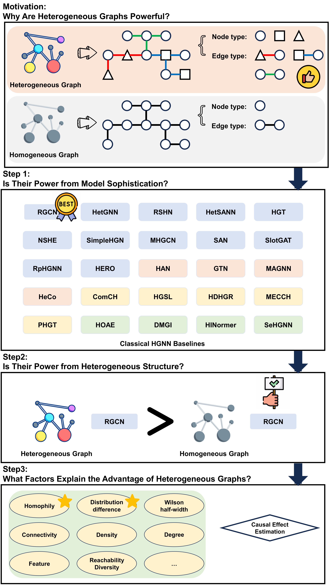

# 🧩 Are Heterogeneous Graph Neural Networks Truly Effective?  

> 📄 *Official implementation of our paper*  
> **"Are Heterogeneous Graph Neural Networks Truly Effective? A Causal Perspective"**  
> *(under review at **Knowledge-Based Systems (KBS)**).*

---

### 🧠 Abstract (shortened)

Heterogeneous Graph Neural Networks (HGNNs) extend traditional GNNs by integrating multiple relation types and semantic information. However, whether HGNNs are **intrinsically effective** remains unclear, as most studies assume rather than establish their causal validity. This work disentangles the effects of **model architecture** and **heterogeneous information** through large-scale reproduction across 21 datasets and 20 baselines. We introduce a **causal effect estimation framework** that evaluates candidate factors under factual and counterfactual analyses, with robustness validated via minimal sufficient adjustment sets, cross-method consistency, and sensitivity analyses.  
Our findings reveal that architectural complexity has **no causal impact** on performance, while heterogeneous information improves accuracy by enhancing **homophily** and **local–global distribution discrepancy**, making node classes more distinguishable.  

---

### 🌟 Highlights
1. 📊 A comprehensive **benchmark for HGNNs** with 21 datasets and 20 baselines  
2. 🧱 **Model architecture** and complexity show *no causal effect* on performance  
3. 🔗 **Homophily** and **distribution discrepancy** are the *key causal factors* underlying HGNN effectiveness  

---

### 📜 Framework Overview

We summarize the overall reasoning process of this study in three causal steps:  

1️⃣ *Is their power from model sophistication?*  
2️⃣ *Is their power from heterogeneous structure?*  
3️⃣ *What factors explain the advantage of heterogeneous graphs?*  

<p align="center">
  
</p>

---


### 🚀 Run

To reproduce the benchmark results, run the following commands:

```bash
python run.py --dataset <ModelName/DatasetName> [arguments]

# DMGI
python run.py --feats_type 1 --hidden_dim 64 --num_layers 1 --lr 0.01 --feat_drop 0.3 --edge_drop 0 --weight_decay 0 --dataset DMGI/ACM --vc 10
python run.py --feats_type 0 --hidden_dim 128 --num_layers 1 --lr 0.001 --feat_drop 0.5 --edge_drop 0 --weight_decay 0.0001 --dataset DMGI/IMDB --vc 4
python run.py --feats_type 0 --hidden_dim 4096 --num_layers 0 --lr 0.001 --feat_drop 0. --edge_drop 0.9999 --weight_decay 0.0001 --dataset DMGI/Amazon --vc 5 --use_residual --use_self_gating

# GTN
python run.py --feats_type 0 --hidden_dim 64 --num_layers 1 --lr 0.001 --feat_drop 0.5 --edge_drop 0 --weight_decay 0.0001 --dataset GTN/ACM --vc 5
python run.py --feats_type 0 --hidden_dim 128 --num_layers 1 --lr 0.001 --feat_drop 0.5 --edge_drop 0 --weight_decay 0.00001 --dataset GTN/IMDB --vc 0 --use_residual --use_self_gating
python run.py --feats_type 0 --hidden_dim 64 --num_layers 1 --lr 0.001 --feat_drop 0. --edge_drop 0 --weight_decay 0.0001 --dataset GTN/DBLP --vc 0 --use_residual --use_self_gating

# HGSL
python run.py --feats_type 2 --hidden_dim 512 --num_layers 0 --lr 0.001 --feat_drop 0 --edge_drop 0 --weight_decay 0 --dataset HGSL/Yelp --vc 100 --use_residual --use_self_gating
python run.py --feats_type 0 --hidden_dim 256 --num_layers 1 --lr 0.001 --feat_drop 0 --edge_drop 0 --weight_decay 0 --dataset HGSL/DBLP --vc 1 --use_residual --use_self_gating

# HOAE
python run.py --feats_type 0 --hidden_dim 64 --num_layers 3 --lr 0.001 --feat_drop 0.4 --edge_drop 0. --weight_decay 0.0001 --dataset HOAE/ACM --vc 50 --use_residual --batchnorm

# MAGNN
python run.py --feats_type 0 --hidden_dim 64 --num_layers 3 --lr 0.001 --feat_drop 0. --edge_drop 0. --weight_decay 0 --dataset MAGNN/DBLP --vc 3 --use_residual --use_self_gating
python run.py --feats_type 0 --hidden_dim 128 --num_layers 1 --lr 0.001 --feat_drop 0.4 --edge_drop 0. --weight_decay 0. --dataset MAGNN/IMDB --vc 1

# MHGCN
python run.py --feats_type 0 --hidden_dim 64 --num_layers 1 --lr 0.001 --feat_drop 0. --edge_drop 0. --weight_decay 0. --dataset MHGCN/DBLP --vc 50 --use_self_gating --batchnorm

# HERO
python run.py --feats_type 0 --hidden_dim 64 --num_layers 1 --lr 0.01 --feat_drop 0. --edge_drop 0. --weight_decay 0. --dataset HERO/ACM --vc 5
python run.py --feats_type 0 --hidden_dim 64 --num_layers 3 --lr 0.001 --feat_drop 0. --edge_drop 0. --weight_decay 0.0001 --dataset HERO/DBLP --vc 0 --use_residual --batchnorm

# HetGNN
python run.py --feats_type 0 --hidden_dim 64 --num_layers 1 --lr 0.001 --feat_drop 0. --edge_drop 0. --weight_decay 0.0001 --dataset HetGNN/Academic2 --vc 50 --use_residual --batchnorm

# HGB
python run.py --feats_type 0 --hidden_dim 192 --num_layers 1 --lr 0.001 --feat_drop 0.1 --edge_drop 0. --weight_decay 0.0001 --dataset HGB/ACM --vc 0 --batchnorm
python run.py --feats_type 3 --hidden_dim 64 --num_layers 6 --lr 0.001 --feat_drop 0. --edge_drop 0. --weight_decay 0. --dataset HGB/DBLP --vc 0 --use_residual --batchnorm
```

---

### 🧩 GCN (Homogeneous) Runs

To examine whether HGNNs’ improvements arise from architecture or from heterogeneous information,  
we also reproduce all models on their **homogeneous graph counterparts** by enabling the `--homo` flag.  
These runs serve as **control experiments** in our causal analysis, allowing a fair comparison between  
heterogeneous and homogeneous settings under identical hyperparameter configurations.

You can reproduce the homogeneous baselines with the following commands:
```bash
# DMGI
python run.py --feats_type 0 --hidden_dim 128 --num_layers 3 --lr 0.001 --feat_drop 0.3 --edge_drop 0.05 --weight_decay 0.0001 --dataset DMGI/ACM --vc 50 --homo --use_residual --use_self_gating --batchnorm
python run.py --feats_type 0 --hidden_dim 256 --num_layers 3 --lr 0.001 --feat_drop 0.2 --edge_drop 0 --weight_decay 0. --dataset DMGI/IMDB --vc 0 --homo --use_residual
python run.py --feats_type 0 --hidden_dim 512 --num_layers 2 --lr 0.001 --feat_drop 0. --edge_drop 0.7 --weight_decay 0.0001 --dataset DMGI/Amazon --vc 0 --homo --use_residual --batchnorm

# GTN
python run.py --feats_type 0 --hidden_dim 64 --num_layers 4 --lr 0.001 --feat_drop 0.5 --edge_drop 0 --weight_decay 0.0001 --dataset GTN/ACM --vc 0 --homo --use_residual
python run.py --feats_type 0 --hidden_dim 128 --num_layers 2 --lr 0.001 --feat_drop 0. --edge_drop 0. --weight_decay 0. --dataset GTN/IMDB --vc 0 --homo
python run.py --feats_type 0 --hidden_dim 128 --num_layers 1 --lr 0.001 --feat_drop 0. --edge_drop 0. --weight_decay 0. --dataset GTN/DBLP --vc 5 --homo

# HGSL
python run.py --feats_type 0 --hidden_dim 64 --num_layers 5 --lr 0.001 --feat_drop 0. --edge_drop 0. --weight_decay 0.0001 --dataset HGSL/Yelp --vc 0 --homo --use_residual
python run.py --feats_type 0 --hidden_dim 128 --num_layers 3 --lr 0.001 --feat_drop 0. --edge_drop 0. --weight_decay 0. --dataset HGSL/DBLP --vc 0 --homo --use_residual

# HOAE
python run.py --feats_type 0 --hidden_dim 64 --num_layers 2 --lr 0.001 --feat_drop 0. --edge_drop 0 --weight_decay 0 --dataset HOAE/ACM --vc 0 --homo

# MAGNN
python run.py --feats_type 0 --hidden_dim 64 --num_layers 7 --lr 0.001 --feat_drop 0. --edge_drop 0 --weight_decay 0. --dataset MAGNN/DBLP --vc 0 --homo --use_residual
python run.py --feats_type 0 --hidden_dim 64 --num_layers 2 --lr 0.001 --feat_drop 0. --edge_drop 0. --weight_decay 0. --dataset MAGNN/IMDB --vc 3 --homo --use_residual --use_self_gating

# MHGCN
python run.py --feats_type 0 --hidden_dim 64 --num_layers 6 --lr 0.001 --feat_drop 0. --edge_drop 0 --weight_decay 0 --dataset MHGCN/DBLP --vc 0 --homo --use_residual --use_self_gating

# HERO
python run.py --feats_type 0 --hidden_dim 64 --num_layers 3 --lr 0.01 --feat_drop 0. --edge_drop 0 --weight_decay 0 --dataset HERO/ACM --vc 0 --homo --use_residual
python run.py --feats_type 0 --hidden_dim 64 --num_layers 7 --lr 0.001 --feat_drop 0. --edge_drop 0 --weight_decay 0. --dataset HERO/DBLP --vc 50 --homo --use_residual

# HetGNN
python run.py --feats_type 0 --hidden_dim 64 --num_layers 3 --lr 0.001 --feat_drop 0. --edge_drop 0 --weight_decay 0 --dataset HetGNN/Academic2 --vc 0 --homo --use_residual --batchnorm

# HGB
python run.py --feats_type 0 --hidden_dim 256 --num_layers 1 --lr 0.001 --feat_drop 0. --edge_drop 0. --weight_decay 0.0001 --dataset HGB/ACM --vc 5 --homo --batchnorm
python run.py --feats_type 0 --hidden_dim 256 --num_layers 8 --lr 0.001 --feat_drop 0. --edge_drop 0 --weight_decay 0. --dataset HGB/DBLP --vc 0 --homo --use_residual --batchnorm

# AMHGNN
python run.py --feats_type 0 --hidden_dim 64 --num_layers 3 --lr 0.001 --feat_drop 0. --edge_drop 0.1 --weight_decay 0 --dataset AMHGNN/Yelp --vc 0 --homo --use_residual --use_self_gating

# SAN
python run.py --feats_type 0 --hidden_dim 1024 --num_layers 6 --lr 0.001 --feat_drop 0. --edge_drop 0. --weight_decay 0. --dataset SAN/Alicoco --vc 0 --homo --use_residual
```
